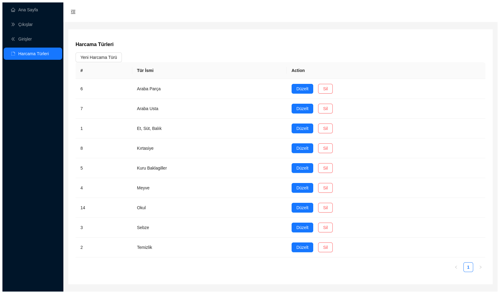
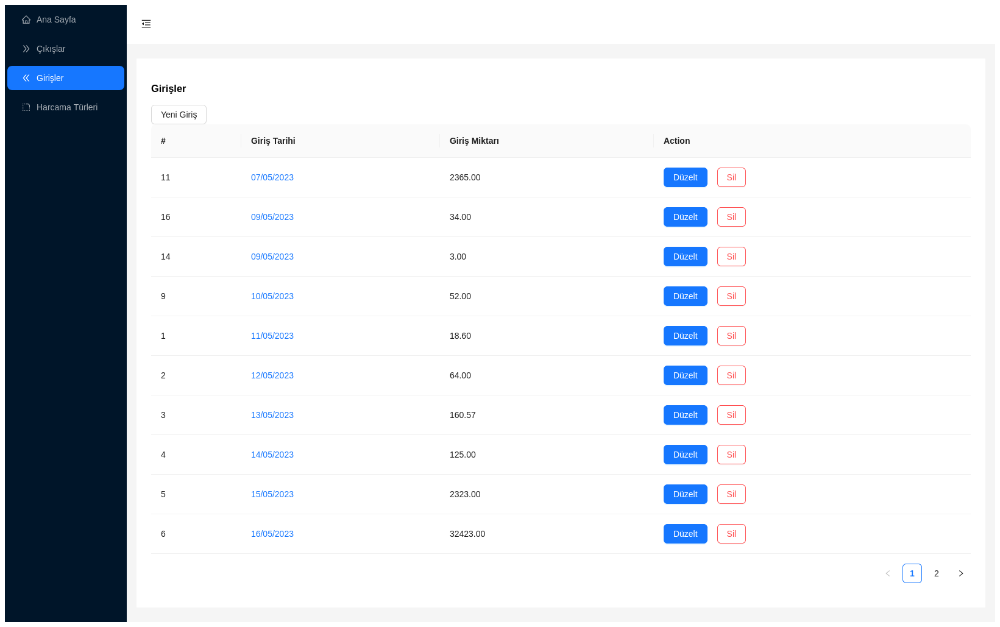
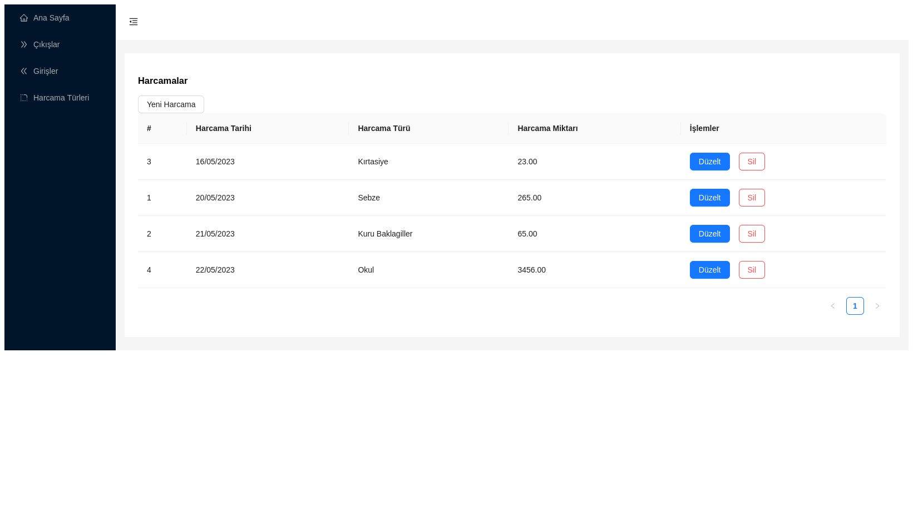

# Getting Started with Harcama Takib App

Track Expenses

# Keywords
Track Expenses, React, Redux, Ant Design Components

# Available Scripts

In the project directory, you can run:

## `npm start`

Runs the app in the development mode.\

## `npm run build`

Builds the app for production to the `build` folder.\

## Learn More

It is an application built with React to track expenses.

## Screenshots

